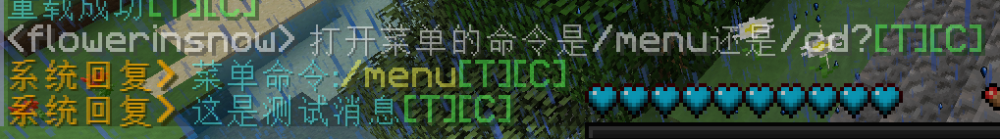

# SystemReply
Bukkit/系统自动回复

## 效果


# 配置
一切条目位于`entries.yml`的根节点下

基本配置如下
```yaml
# 路径名 同时作为条目名
example:
  # 匹配规则列表，任意一条匹配将会停止匹配
  # <i>开头为不区分大小写
  # S: 开头的为普通匹配，没有则默认该匹配
  # R: 开头为正则匹配
  # SE: 开头为精准普通匹配
  # 不提供精通正则匹配，请使用^和$元字符
  # 例如：
  # 'SE:HelloWorld' - 表示精准匹配HelloWorld
  # '<i>R:服务器的[0-9]{1,3}名玩家你们好' - 表示不区分大小写该正则表达式
  patterns:
    - '菜单命令'
    - 'SE:怎么打开菜单'
    - '<i>R:打开菜单的(命|指)令是/(menu|cd)还是/(menu|cd)(\?|？)?'
  # 回复消息；变量：
  # %(PREFIX) - 前缀，可在messages.yml配置
  # 可选，默认不发送消息
  replies:
    - '%(PREFIX)&b菜单命令：&e/menu'
  # 获取触发所需的权限
  permissions:
    - 'systemreply.entry.example'
  # 是否允许继续匹配其他消息，允许多次匹配并多次回复，根据条目顺序进行判断，直到pass为false为止
  # 可选，默认true
  pass: true
  # 是否阻止该消息发送出去
  # 可选，默认false
  block: false
  # 当该值为true时，回复消息将会在玩家的消息发送出去之后发送给玩家
  # 反之，回复消息将会在玩家的消息发送出去之前就会发送给玩家
  # 可选，默认true
  after: true
```

# 命令
`/systemreply reload` - 重载

# 权限
拥有`systemreply.tab`的玩家可以使用TAB补全

# API
## 引入仓库
```xml
<repository>
    <id>SystemReply</id>
    <url>https://maven.pkg.github.com/flowerinsnow-lights-opensource/SystemReply</url>
</repository>
```

## 导入依赖
```xml
<dependency>
    <groupId>online.flowerinsnow</groupId>
    <artifactId>SystemReply-API</artifactId>
    <version>1.0.0</version>
    <scope>provided</scope>
    <optional>true</optional>
</dependency>
```

## 后续步骤
### 依赖指定
`plugin.yml`
```yaml
depend:
  - SystemReply
```

### 软依赖
或者，这不是必须的，那就
`plugin.yml`
```yaml
softdepend:
  - SystemReply
```
然后在插件中可以这么判断
```java
public void onEnable(){
    if (getServer().getPluginManager().isPluginEnabled("SystemReply")) {
        getLogger().info("前置插件SystemReply已加载，可以使用API");
    }
}
```

### 调用入口
```java
online.flowerinsnow.systemreply.api.SystemReplyAPI.getInstance()
```
其他不写了，去看javadoc去ww

# 使用的第三方依赖库
[MineConfiguration](https://github.com/CarmJos/MineConfiguration) By [@CarmJos](https://github.com/CarmJos) (LGPL-3.0 license)

# 开源协议
使用[GPL 3.0](https://www.gnu.org/licenses/gpl-3.0.html)作为基础协议

除非二次分发，否则不需要开源